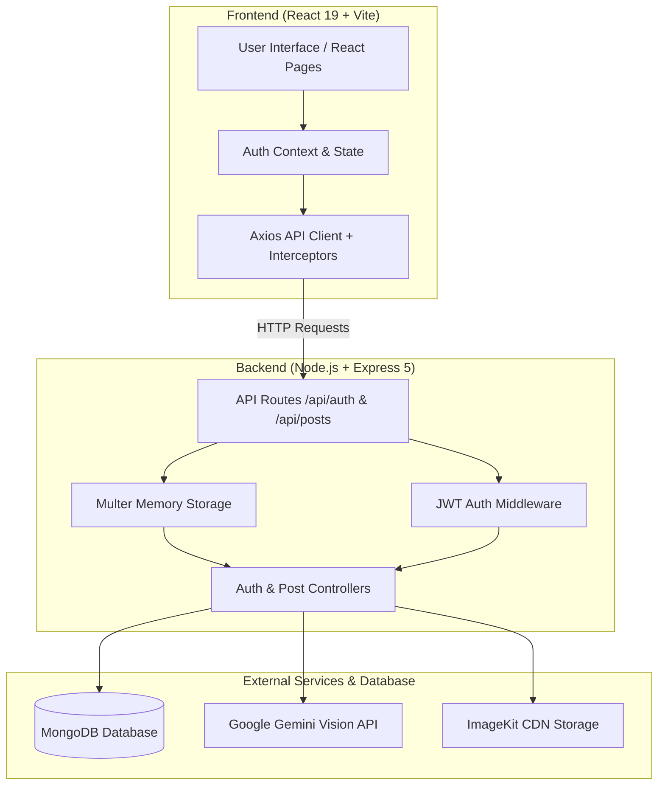

# SocialSync

An AI-assisted social media caption generation platform built with React 19, Node.js, Express, MongoDB, and the Google Gemini Vision API.

## Overview

SocialSync bridges the gap between image content creation and social media copywriting. Creating engaging captions for photos often requires manual effort or creative brainstorming. SocialSync automates this workflow by allowing users to upload image assets and receive context-aware, concise social media captions populated with relevant hashtags and emojis.

The platform provides a complete end-to-end full-stack workflow. On the frontend, a responsive single-page application built with React 19, Tailwind CSS v4, and Framer Motion handles client-side routing, user authentication state, drag-and-drop file ingestion, and real-time UI feedback. On the backend, an Express server processes multi-part form image uploads using Multer, converts image streams into base64 payloads for direct multimodal evaluation via Google's Gemini Vision model, uploads image assets to ImageKit CDN storage, and persists post metadata in MongoDB.

Security and access control are implemented using JSON Web Tokens (JWT) stored in HTTP-only cookies and Authorization headers, with password hashing handled by bcrypt.

---

## Highlights

- **JWT Authentication & Session Management**: Secure user registration and login using bcrypt password hashing and token-based session persistence.
- **Multimodal AI Caption Generation**: Automatic context-aware caption generation from image uploads using Google Gemini (`gemini-flash-latest`).
- **Cloud Image Storage**: Automated media file upload and CDN asset delivery via ImageKit integration.
- **Interactive Workspace Dashboard**: Drag-and-drop file upload interface, image preview, copy-to-clipboard functionality, and active session history tracking.
- **Responsive Modern UI Design**: Mobile-friendly interface built with React 19, Tailwind CSS v4, Framer Motion animations, and Lucide icon sets.
- **RESTful API Architecture**: Decoupled Express backend API with modular controllers, routes, middlewares, and services.

---

## Technical Architecture



### Request Lifecycle Flow
1. **User Authentication**: The client submits user credentials to `/api/auth/register` or `/api/auth/login`. Upon validation, the Express backend issues a signed JWT delivered via HTTP-only cookie and JSON response body.
2. **Media Upload & Processing**: In the dashboard, an image file is attached via `Multipart/Form-Data` and posted to `/api/posts/post`. The request passes through `authMiddleware` for token validation and `multer` memory buffer extraction.
3. **AI Vision & Cloud Upload Pipeline**:
   - The buffer is base64-encoded and transmitted to the `@google/genai` SDK targeting the `gemini-flash-latest` model.
   - Concurrently, the file buffer is uploaded to ImageKit CDN storage (`SocialSync` directory).
4. **Data Persistence & Client Response**: The generated caption text and returned ImageKit CDN URL are saved as a post record in MongoDB via Mongoose, and returned to the client to update local workspace state.

---

## Core Features & Technical Implementation

### 1. Authentication & Security Layer
- **Implementation**: Hashing passwords using `bcrypt` (10 salt rounds) before DB persistence in `user.models.js`.
- **Session Tokens**: JWT creation with configurable expiration (`7d`). Tokens are returned both as `httpOnly` cookies and Bearer tokens for header-based API authorization (`AuthContext.jsx` & `auth.middleware.js`).
- **Protected Routes**: React Router wrapper (`ProtectedRoute.jsx`) that verifies token validity via `/api/auth/me` before rendering protected routes such as `/dashboard`.

### 2. Multimodal AI Caption Generation
- **Implementation**: The backend `ai.service.js` utilizes `@google/genai` to communicate with Google's multimodal Gemini vision model (`gemini-flash-latest`).
- **Prompt Engineering**: The model is provided structured system instructions to produce short, engaging, hashtag- and emoji-enriched captions tailored for social media publishing.

### 3. File Processing & Cloud Media Storage
- **Implementation**: Express uses `multer.memoryStorage()` to process uploaded image files in-memory without writing temporary files to server disk.
- **CDN Storage**: `storage.service.js` interfaces with `ImageKit` SDK to upload image buffers into organized folder structures and retrieve optimized CDN URLs.

### 4. Interactive Studio Dashboard
- **Implementation**: Built with React hooks (`useState`) to manage upload states, live image previews, copy functionality, and an in-memory session history feed.
- **User Experience**: Animated loading overlays (`framer-motion`) and toast feedback (`react-hot-toast`) provide clear status updates during network calls.

---

## Tech Stack

### Frontend
- **Framework**: React 19 (`react`, `react-dom`)
- **Build Tool**: Vite 6 (`vite`, `@vitejs/plugin-react`)
- **Routing**: React Router DOM v7 (`react-router-dom`)
- **Styling**: Tailwind CSS v4 (`tailwindcss`, `@tailwindcss/vite`)
- **Animations**: Framer Motion (`framer-motion`)
- **Icons & Notifications**: Lucide React (`lucide-react`), React Hot Toast (`react-hot-toast`)
- **HTTP Client**: Axios (`axios`) with request/response interceptors

### Backend
- **Runtime**: Node.js
- **Framework**: Express.js 5 (`express`)
- **Middleware**: Cookie Parser (`cookie-parser`), CORS (`cors`), Multer (`multer`)
- **Authentication**: JSON Web Token (`jsonwebtoken`), Bcrypt (`bcrypt`)
- **Utilities**: Dotenv (`dotenv`), UUID (`uuid`)

### Database
- **Primary Database**: MongoDB
- **ODM**: Mongoose (`mongoose`)

### External Services & Cloud APIs
- **AI / LLM Integration**: Google GenAI SDK (`@google/genai`) — Gemini Vision (`gemini-flash-latest`)
- **Media Storage & CDN**: ImageKit (`imagekit`)

---

## API Endpoints

### Authentication (`/api/auth`)
| Method | Endpoint | Access | Description |
| :--- | :--- | :--- | :--- |
| `POST` | `/api/auth/register` | Public | Register a new user (`username`, `email`, `password`) |
| `POST` | `/api/auth/login` | Public | Authenticate user (`identifier` [username/email], `password`) |
| `GET` | `/api/auth/me` | Protected | Fetch current authenticated user profile |
| `GET` | `/api/auth/health` | Public | Health check route for backend service status |

### Posts & Captions (`/api/posts`)
| Method | Endpoint | Access | Description |
| :--- | :--- | :--- | :--- |
| `POST` | `/api/posts/post` | Protected | Upload image file (`multipart/form-data`), generate AI caption, store on ImageKit & MongoDB |
| `POST` | `/api/posts/generate` | Protected | Alias endpoint for post creation and caption generation |

---

## Project Structure

```text
SocialSync/
├── public/                     # Static public assets
├── src/
│   ├── components/             # Reusable UI components
│   │   ├── layout/             # Header (Navbar) and Footer components
│   │   ├── AnimatedBackground.jsx
│   │   ├── CaptionCard.jsx     # Display & copy generated caption
│   │   ├── CaptionExamples.jsx # Landing page caption samples
│   │   ├── FAQ.jsx             # FAQ accordion
│   │   ├── FeatureCard.jsx     # Landing page feature cards
│   │   ├── FileUpload.jsx      # Drag & drop image uploader
│   │   ├── GlassCard.jsx       # Glassmorphism container wrapper
│   │   ├── GradientButton.jsx  # Styled interactive button
│   │   ├── ImagePreview.jsx    # Image preview before submission
│   │   ├── Input.jsx           # Reusable form input
│   │   ├── LoadingSpinner.jsx  # Processing overlays
│   │   ├── ProtectedRoute.jsx  # Route auth guard
│   │   └── ToastProvider.jsx   # Toast notifications container
│   ├── context/
│   │   └── AuthContext.jsx     # Authentication state provider
│   ├── controllers/            # Request handlers
│   │   ├── auth.controller.js  # Registration, login logic
│   │   ├── health.controller.js# Service health handler
│   │   └── post.controller.js  # Post creation & AI caption handler
│   ├── db/
│   │   └── db.js               # MongoDB connection setup
│   ├── hooks/
│   │   └── usePageTitle.js     # Dynamic document title hook
│   ├── lib/
│   │   └── motion.js           # Framer motion variants
│   ├── middlewares/
│   │   └── auth.middleware.js  # JWT validation middleware
│   ├── models/                 # Mongoose schemas
│   │   ├── post.model.js       # Post schema (image, caption, user ref)
│   │   └── user.models.js      # User schema (username, email, password)
│   ├── pages/                  # Application views
│   │   ├── Dashboard.jsx       # Workspace / caption studio
│   │   ├── Landing.jsx         # Product landing page
│   │   ├── Login.jsx           # User login view
│   │   ├── NotFound.jsx        # 404 error page
│   │   └── Signup.jsx          # User registration view
│   ├── routes/                 # Route declarations
│   │   ├── AppRoutes.jsx       # React Router client routes
│   │   ├── auth.routes.js      # Auth API endpoints
│   │   └── post.routes.js      # Post API endpoints
│   ├── services/               # External services & API clients
│   │   ├── ai.service.js       # Google Gemini Vision integration
│   │   ├── api.js              # Axios instance & frontend service calls
│   │   └── storage.service.js  # ImageKit upload integration
│   ├── App.jsx                 # Root React component
│   ├── app.js                  # Express application setup
│   ├── index.css               # Tailwind CSS imports & global styles
│   └── main.jsx                # React application entry point
├── .env.example                # Template for environment variables
├── index.html                  # HTML entry point
├── package.json                # Project dependencies & scripts
├── README.md                   # Project documentation
├── server.js                   # Node.js backend server entry point
├── vercel.json                 # Vercel deployment configuration
└── vite.config.js              # Vite configuration
```

---

## Environment Variables Setup

Create a `.env` file in the root directory based on `.env.example`:

```env
# Server Configuration
PORT=4000
CLIENT_URL=http://localhost:5173

# Database Configuration
MONGODB_URL=mongodb+srv://<username>:<password>@cluster0.mongodb.net/socialsync

# Security
JWT_SECRET=your_jwt_secret_key_here

# AI Service (Google Gemini)
GEMINI_API_KEY=your_gemini_api_key_here

# Storage Service (ImageKit)
IMAGEKIT_PUBLIC_KEY=your_imagekit_public_key
IMAGEKIT_PRIVATE_KEY=your_imagekit_private_key
IMAGEKIT_URL_ENDPOINT=your_imagekit_url_endpoint

# Frontend Configuration (Vite)
VITE_API_URL=http://localhost:4000/api
```

---

## Getting Started

### Prerequisites
- **Node.js**: v18.x or higher
- **npm**: v9.x or higher
- **MongoDB**: A running MongoDB instance or MongoDB Atlas cluster URI
- **Google Gemini API Key**: Obtained from Google AI Studio
- **ImageKit Account**: Public key, private key, and URL endpoint

### Installation

1. **Clone the repository**:
   ```bash
   git clone https://github.com/<your-username>/SocialSync.git
   cd SocialSync
   ```

2. **Install dependencies**:
   ```bash
   npm install
   ```

3. **Configure environment variables**:
   Copy `.env.example` to `.env` and fill in your credentials:
   ```bash
   cp .env.example .env
   ```

### Running Locally

1. **Start the Express backend server**:
   ```bash
   npm run server
   ```
   The backend API will start on `http://localhost:4000`.

2. **Start the Vite frontend development server** (in a separate terminal window):
   ```bash
   npm run dev
   ```
   The application will be accessible at `http://localhost:5173`.

### Production Build

To test or generate the frontend production build:
```bash
npm run build
```
To preview the production build locally:
```bash
npm run preview
```

---

## License

ISC License
