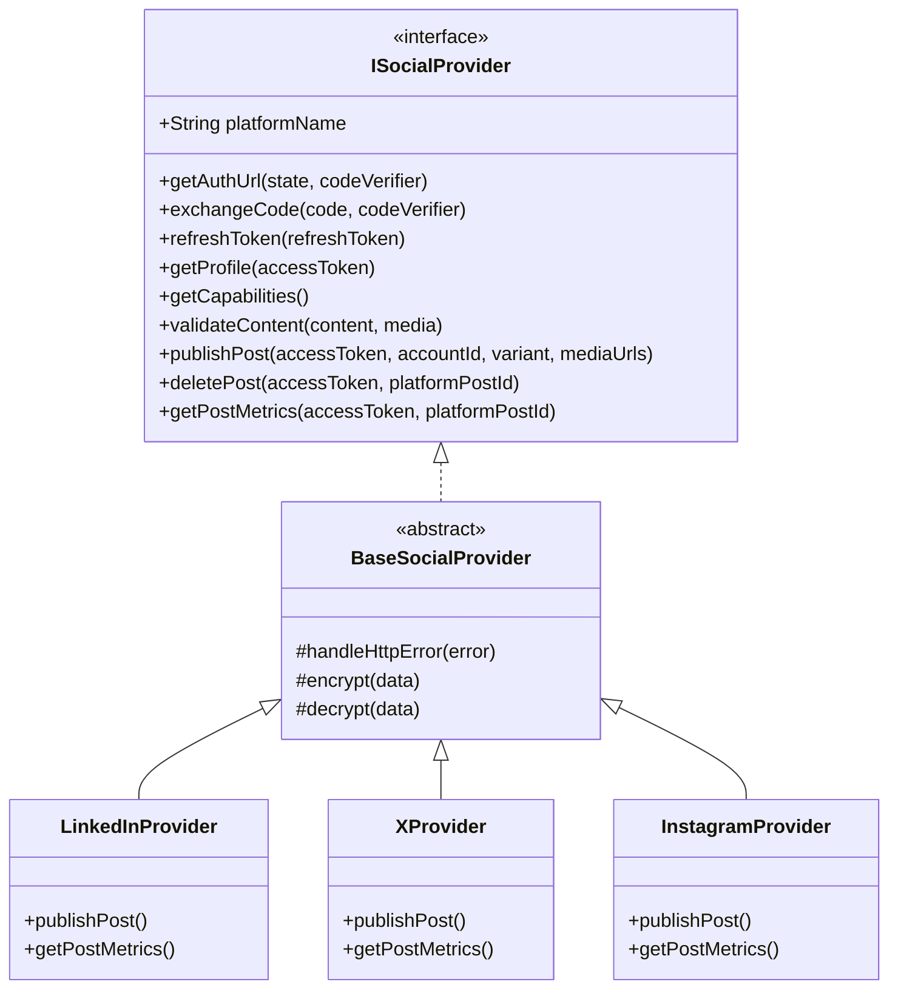
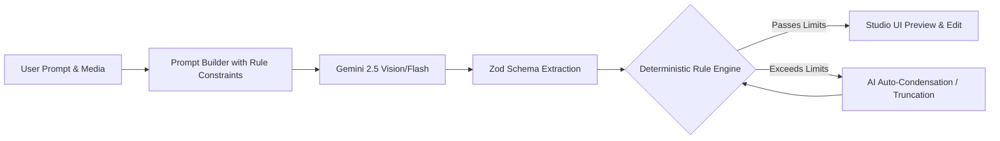
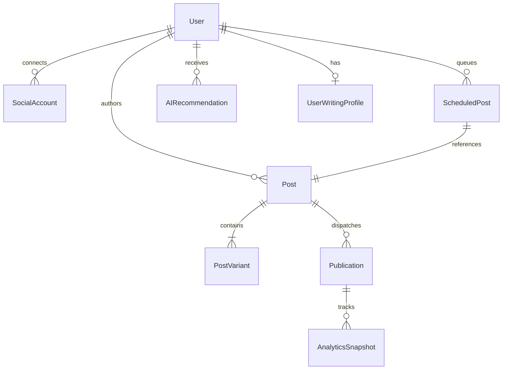
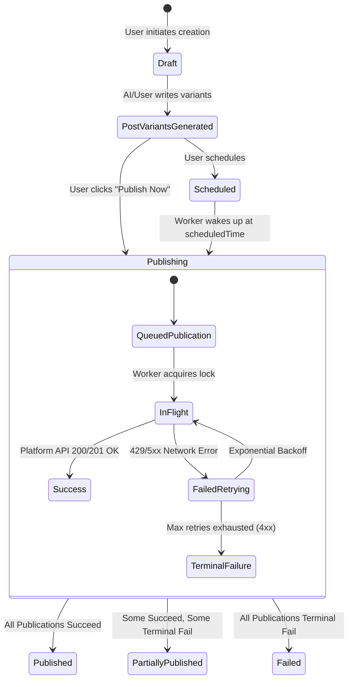
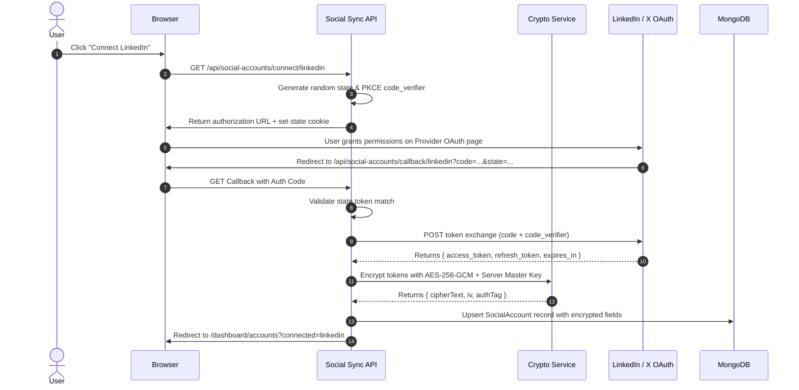
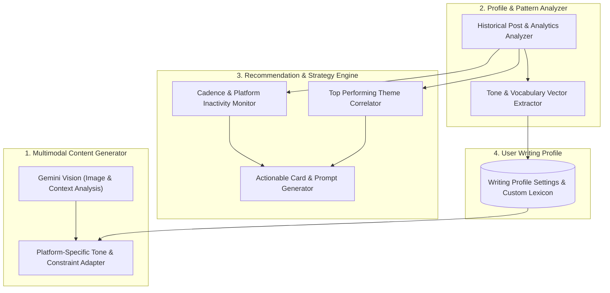
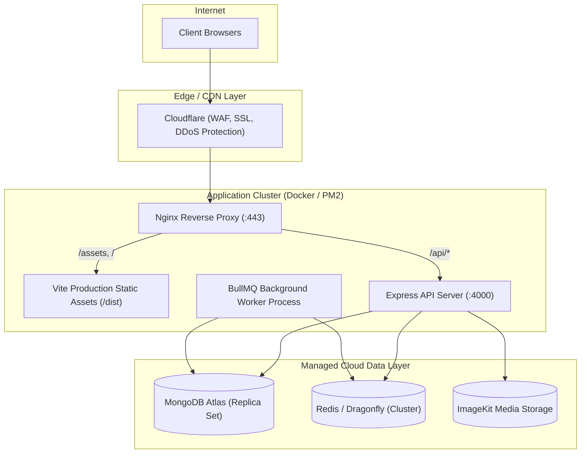
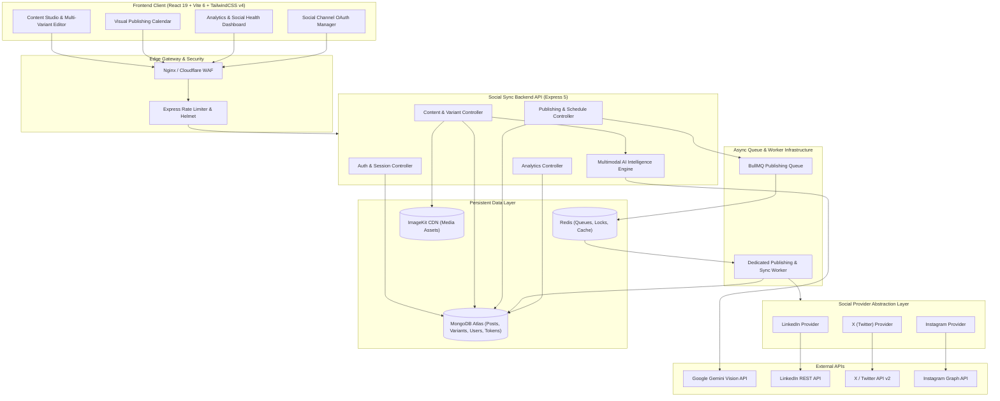

# SOCIAL SYNC — MASTER PRODUCT & TECHNICAL BLUEPRINT

> **Document Version:** 1.0.0  
> **Status:** Approved Architectural Blueprint  
> **Author:** Senior Software Architect, Staff Full-Stack Engineer, Security Engineer, DevOps Lead  
> **Target System:** Production-Grade AI Personal Social Media Operating System  

---

## 1. Product Vision

**Social Sync** is an enterprise-grade, AI-powered Personal Social Media Operating System. It empowers individual creators, thought leaders, agency marketers, and growing brands to connect their fragmented social media presence once, orchestrate platform-native content creation with multimodal AI, publish or schedule seamlessly across heterogeneous social networks, maintain deep multi-platform history, aggregate performance analytics, and receive proactive, actionable AI strategy recommendations.

Social Sync transforms social management from a reactive, manual chore into an autonomous, intelligence-driven feedback loop.

---

## 2. Product Principles

Social Sync is **not** a basic AI caption generator or a simple CRUD wrapper around social APIs. It is a **Unified Social Operating System**.

The platform is engineered around the closed-loop **Social Intelligence Lifecycle**:

```text
       ┌───────────────┐
       │   1. CREATE   │ ◄── Multimodal AI + Platform Rules
       └───────┬───────┘
               │
               ▼
       ┌───────────────┐
       │  2. PUBLISH   │ ◄── Instant Dispatch or Scheduled Workers
       └───────┬───────┘
               │
               ▼
       ┌───────────────┐
       │  3. MEASURE   │ ◄── Automated Snapshot Collection
       └───────┬───────┘
               │
               ▼
       ┌───────────────┐
       │ 4. UNDERSTAND │ ◄── Performance Pattern Extraction
       └───────┬───────┘
               │
               ▼
       ┌───────────────┐
       │ 5. RECOMMEND  │ ◄── Actionable Strategy & Prompts
       └───────┬───────┘
               │
               └────────► Loops back to CREATE
```

### Core Tenets:
1. **Platform Nativeness over Generic Broadcasting**: Every social platform has unique cultural norms, algorithms, character ceilings, and media formatting rules. Social Sync never blasts identical text across networks; it intelligently adapts content for each network's native voice.
2. **Determinism over AI Hallucination**: AI generates creative options; deterministic rule engines enforce hard platform boundaries (character limits, media ratios, rate limits).
3. **Security First**: Social OAuth access and refresh tokens are encrypted at rest with industry-standard AES-256-GCM.
4. **Resilient Scheduling**: Scheduled jobs must never be lost, double-posted, or silently dropped. Distributed queues with idempotency keys guarantee reliable delivery.
5. **Actionable Intelligence**: AI recommendations must be backed by real collected analytics, accompanied by 1-click execution actions.

---

## 3. Target Users

| Persona | Primary Goal | Pain Points Solved | Key Features Leveraged |
| :--- | :--- | :--- | :--- |
| **Independent Creators & Influencers** | Build personal brand across Instagram, X, Threads, and LinkedIn simultaneously. | Context-switching between apps; creative burnout; forgetting to post consistently. | Multimodal Content Studio, AI Writing Profile, Multi-platform scheduling. |
| **B2B Founders & Tech Executives** | Establish industry authority on LinkedIn and X with minimal time investment. | Writing thoughtful long-form copy takes hours; uncertain optimal posting times. | AI Tone Matcher, Repurposing engine, Post-level engagement analytics. |
| **Freelance Social Media Managers** | Manage multiple brand social channels from a single unified studio. | Logging in/out of client accounts; tracking approval states; manual formatting. | Workspace organization, Platform preview simulator, Batch scheduling. |
| **Small Businesses & E-commerce Brands** | Maintain consistent promotion and customer engagement with limited staff. | Inability to hire full-time copywriters; irregular posting cadences. | Weekly AI Content Planner, Image-to-Campaign generation, Social Health Score. |

---

## 4. Core User Journey

```text
[Step 1: Onboarding]
User Registers / Authenticates
  └─► Provision Encrypted Workspace & User Profile
        └─► Onboarding Wizard Prompts Social Account Connection

[Step 2: Social Account Connection]
User selects Social Networks (e.g., LinkedIn, X, Instagram)
  └─► Initiates OAuth 2.0 PKCE Authorization Code Grant
        └─► Callback exchanges code for Access & Refresh Tokens
              └─► Tokens Encrypted (AES-256-GCM) & Persisted
                    └─► Initial Profile & Capability Fetch

[Step 3: Intelligence Baseline]
Background Worker synchronizes recent public posts & metrics
  └─► AI Profile Analyzer computes baseline "Social Health Score"
        └─► Workspace populates with initial actionable recommendations

[Step 4: Content Creation & Adaptation]
User enters Content Studio
  ├─► Uploads Media (Image/Video) or Enters Topic Context
  ├─► Selects Target Platforms (e.g., [LinkedIn, Instagram, X])
  ├─► Chooses Tone, Objective, & Custom Writing Profile
  └─► Clicks "Generate Multi-Platform Content"
        └─► Multimodal AI produces Platform-Specific Variants
              └─► Platform Content Rules validate constraints
                    └─► Studio renders live platform mockups for side-by-side editing

[Step 5: Dispatch / Schedule]
User approves variants and selects action:
  ├─ Option A: "Publish Now"
  │    └─► Backend creates Post & Publication records
  │          └─► Synchronous/Async Provider Dispatch with Idempotency
  │                └─► Real-time UI updates with live publication URLs
  │
  └─ Option B: "Schedule for Later"
       └─► User selects Date/Time & Timezone (or AI Optimal Slot)
             └─► ScheduledPost created; BullMQ delayed job registered
                   └─► Calendar UI displays scheduled item

[Step 6: Measurement & Insights Loop]
Worker executes periodic analytics synchronization (1h, 24h, 7d intervals)
  └─► AnalyticsSnapshots stored for each publication
        └─► AI Recommendation Engine detects trends (e.g., "Evening posts gain 2.4x reach")
              └─► Dashboard displays updated recommendations with "Create Post" action buttons
```

---

## 5. MVP (V1) Scope vs. Post-V1 Scope

```text
┌──────────────────────────────────────────────────────────────────────────────┐
│                              V1 SCOPE (MVP)                                  │
├────────────────────────┬─────────────────────────────┬───────────────────────┤
│ Authentication & Core  │ Content & Studio            │ Social Platforms      │
│ • Secure JWT + Cookies │ • Drag-and-drop Image Upload│ • LinkedIn            │
│ • AES-256 Token Crypt  │ • AI Vision & Caption Gen   │   (OAuth2 + Share API)│
│ • User Workspaces      │ • Multi-platform adaptation │ • X / Twitter         │
│ • Helmet + Rate Limits │ • Manual variant override   │   (OAuth2 + v2 Tweets)│
│ • Pino Structured Logs │ • Drafts & Persistent Posts │ • Instagram (FB Graph)│
├────────────────────────┼─────────────────────────────┼───────────────────────┤
│ Publishing & Engine    │ Scheduling                  │ Intelligence          │
│ • Instant Dispatch     │ • Date/Time picker (UTC/TZ) │ • Basic Post Analytics│
│ • Idempotency Keys     │ • BullMQ + Redis Queue      │ • Writing Style Tone  │
│ • Retry & Error alerts │ • Scheduled Calendar View   │ • 3 Actionable Ideas  │
└────────────────────────┴─────────────────────────────┴───────────────────────┘

┌──────────────────────────────────────────────────────────────────────────────┐
│                              POST-V1 ROADMAP                                 │
├────────────────────────┬─────────────────────────────┬───────────────────────┤
│ Additional Platforms   │ Advanced Media              │ Advanced Intelligence │
│ • Threads API          │ • Multi-image Carousels     │ • Social Health Score │
│ • Reddit API           │ • Native Video Uploads      │ • Autonomous Calendar │
│ • YouTube Community    │ • Image Resizing / Cropping │ • Automated Repurpose │
│ • TikTok API / Reels   │ • Media Template Library    │ • Competitor Baseline │
├────────────────────────┼─────────────────────────────┼───────────────────────┤
│ Team Collaboration     │ In-Depth Analytics          │ Webhooks & Live Sync  │
│ • Multi-user Orgs      │ • Time-series Growth Charts │ • Real-time Comments  │
│ • Approval Workflows   │ • Cross-Platform Aggregation│ • Auto-DM Triggers    │
│ • Audit Logs           │ • PDF Export Reports        │ • Unified Inbox       │
└────────────────────────┴─────────────────────────────┴───────────────────────┘
```

---

## 6. Platform Strategy & Feasibility Matrix

| Platform | Authentication | API Endpoint Feasibility | Media Support | Verification / Approval Hurdle | V1 Target |
| :--- | :--- | :--- | :--- | :--- | :---: |
| **LinkedIn** | OAuth 2.0 (Authorization Code) | **High**: `/v2/ugcPosts` or `/rest/posts` allows text, images, articles. | Single Image, Multi-Image, Video, PDFs. | **Low**: Standard Developer App with `w_member_social`, `r_basicprofile`. Instant development testing. | **YES (Priority 1)** |
| **X (Twitter)** | OAuth 2.0 with PKCE | **High**: POST `/2/tweets` with media upload endpoints (`upload.twitter.com`). | Single/Multiple Images, GIFs, Video. | **Medium**: Free/Basic tier limits (Free tier write-only, 1500 tweets/month). Paywalled v2 analytics. | **YES (Priority 2)** |
| **Instagram** | Meta OAuth 2.0 via Facebook Login | **Medium-High**: Instagram Graph API for Professional (Business/Creator) accounts via `/media` and `/media_publish`. | Images, Carousels, Reels, Stories. | **High**: Requires Meta App Review for `instagram_content_publish` permission in production. Works in Dev Mode immediately. | **YES (Priority 3)** |
| **Threads** | Meta OAuth 2.0 for Threads | **High**: Threads Publishing API launched June 2024. | Text, Single Image, Video. | **High**: Requires Meta App Review. | **V2** |
| **Reddit** | OAuth 2.0 (Script/App) | **Medium**: `/api/submit` endpoint for text, link, and image submissions to subreddits. | Text, Image, Link. | **Medium**: Strict subreddit-specific posting rules and karma requirements. | **V2** |
| **YouTube** | Google OAuth 2.0 | **High**: YouTube Data API v3 for Videos & Shorts. | Video, Shorts. | **High**: Quota limits and Google Cloud Security Verification. | **V2** |
| **TikTok** | TikTok for Developers OAuth | **Medium**: Content Posting API. Direct Post & Share to Direct. | Vertical Video only. | **High**: Strict partner app review. | **V3** |

---

## 7. Social Provider Architecture & Abstraction Layer

Social Sync isolates all third-party API interactions behind a unified `ISocialProvider` interface. The core application logic never calls Axios or SDKs directly for social networks.



### The Universal Provider Contract

```typescript
export interface SocialAccountTokens {
  accessToken: string;
  refreshToken?: string;
  expiresAt: Date;
  tokenType: string;
  scopes: string[];
}

export interface SocialUserProfile {
  platformUserId: string;
  username: string;
  displayName: string;
  avatarUrl?: string;
  profileUrl?: string;
  metadata?: Record<string, any>;
}

export interface PublishPayload {
  text: string;
  mediaUrls?: string[];
  linkUrl?: string;
  title?: string;
  tags?: string[];
  options?: Record<string, any>;
}

export interface PublishResult {
  success: boolean;
  platformPostId: string;
  platformPostUrl?: string;
  publishedAt: Date;
  rawResponse?: any;
}

export interface MetricSnapshot {
  impressions?: number;
  reach?: number;
  likes?: number;
  comments?: number;
  shares?: number;
  clicks?: number;
  engagementRate?: number;
  collectedAt: Date;
}

export interface ISocialProvider {
  readonly platformId: string;
  
  getAuthUrl(state: string, codeVerifier?: string): Promise<{ url: string; codeVerifier?: string }>;
  exchangeCode(code: string, codeVerifier?: string, redirectUri?: string): Promise<SocialAccountTokens & { profile: SocialUserProfile }>;
  refreshToken(refreshToken: string): Promise<SocialAccountTokens>;
  getProfile(accessToken: string): Promise<SocialUserProfile>;
  getCapabilities(): PlatformCapabilities;
  validateContent(payload: PublishPayload): ValidationResult;
  publishPost(account: SocialAccountDocument, payload: PublishPayload): Promise<PublishResult>;
  deletePost?(account: SocialAccountDocument, platformPostId: string): Promise<boolean>;
  getPostMetrics(account: SocialAccountDocument, platformPostId: string): Promise<MetricSnapshot>;
}
```

---

## 8. Platform Capability System

To prevent the frontend and scheduling engine from making invalid requests, every provider declares a static **Capability Matrix**.

```typescript
export interface PlatformCapabilities {
  canPublishText: boolean;
  canPublishImage: boolean;
  canPublishVideo: boolean;
  canPublishCarousel: boolean;
  canScheduleNatively: boolean;
  supportsHashtags: boolean;
  supportsCustomLinkThumbnails: boolean;
  supportsMarkdown: boolean;
  maxTextLength: number;
  maxImagesCount: number;
  supportedImageFormats: string[];
  maxImageSizeMB: number;
  supportsAnalytics: boolean;
  supportsPostDeletion: boolean;
}
```

### Static Capability Definitions

```json
{
  "linkedin": {
    "canPublishText": true,
    "canPublishImage": true,
    "canPublishVideo": true,
    "canPublishCarousel": true,
    "canScheduleNatively": false,
    "supportsHashtags": true,
    "supportsCustomLinkThumbnails": true,
    "supportsMarkdown": false,
    "maxTextLength": 3000,
    "maxImagesCount": 9,
    "supportedImageFormats": ["image/jpeg", "image/png", "image/webp", "image/gif"],
    "maxImageSizeMB": 10,
    "supportsAnalytics": true,
    "supportsPostDeletion": true
  },
  "twitter": {
    "canPublishText": true,
    "canPublishImage": true,
    "canPublishVideo": true,
    "canPublishCarousel": false,
    "canScheduleNatively": false,
    "supportsHashtags": true,
    "supportsCustomLinkThumbnails": false,
    "supportsMarkdown": false,
    "maxTextLength": 280,
    "maxImagesCount": 4,
    "supportedImageFormats": ["image/jpeg", "image/png", "image/webp", "image/gif"],
    "maxImageSizeMB": 5,
    "supportsAnalytics": true,
    "supportsPostDeletion": true
  },
  "instagram": {
    "canPublishText": true,
    "canPublishImage": true,
    "canPublishVideo": true,
    "canPublishCarousel": true,
    "canScheduleNatively": false,
    "supportsHashtags": true,
    "supportsCustomLinkThumbnails": false,
    "supportsMarkdown": false,
    "maxTextLength": 2200,
    "maxImagesCount": 10,
    "supportedImageFormats": ["image/jpeg", "image/png"],
    "maxImageSizeMB": 8,
    "supportsAnalytics": true,
    "supportsPostDeletion": false
  }
}
```

---

## 9. Platform Content Rule Engine

Content validation occurs before AI generation (prompt engineering constraints), after AI generation (schema validation), and before dispatch to social APIs (deterministic gatekeeping).



### Deterministic Validation Layer

```typescript
export function validatePostForPlatform(platform: string, payload: PublishPayload): ValidationResult {
  const capabilities = ProviderRegistry.get(platform).getCapabilities();
  const errors: string[] = [];
  const warnings: string[] = [];

  // Text length check
  if (payload.text.length > capabilities.maxTextLength) {
    errors.push(
      `Text exceeds ${platform} limit of ${capabilities.maxTextLength} characters (current: ${payload.text.length}).`
    );
  }

  // Media count check
  const mediaCount = payload.mediaUrls?.length || 0;
  if (mediaCount > capabilities.maxImagesCount) {
    errors.push(
      `${platform} allows a maximum of ${capabilities.maxImagesCount} images (attached: ${mediaCount}).`
    );
  }

  // Platform-specific mandatory media rules
  if (platform === 'instagram' && mediaCount === 0) {
    errors.push('Instagram requires at least one image or video asset.');
  }

  // Hashtag recommendations
  if (platform === 'linkedin') {
    const hashtagCount = (payload.text.match(/#[a-zA-Z0-9_]+/g) || []).length;
    if (hashtagCount > 5) {
      warnings.push('LinkedIn posts perform best with 3 to 5 relevant hashtags.');
    }
  }

  return {
    isValid: errors.length === 0,
    errors,
    warnings,
  };
}
```

---

## 10. Database Architecture & Complete Schemas

All future schemas are designed for MongoDB (Mongoose ODM) with strict relational integrity, compound indexes, and encryption flags.



### Schema Specifications

#### 1. `User` Schema
```javascript
const userSchema = new mongoose.Schema({
  username: { type: String, required: true, unique: true, trim: true, lowercase: true, index: true },
  email: { type: String, required: true, unique: true, trim: true, lowercase: true, index: true },
  password: { type: String, required: true },
  fullName: { type: String, trim: true },
  avatarUrl: { type: String },
  timezone: { type: String, default: 'UTC' },
  role: { type: String, enum: ['user', 'admin'], default: 'user' },
  socialHealthScore: { type: Number, default: 0, min: 0, max: 100 },
  settings: {
    defaultPlatforms: [{ type: String }],
    emailNotifications: { type: Boolean, default: true },
    aiAutoAdapt: { type: Boolean, default: true }
  }
}, { timestamps: true });
```

#### 2. `SocialAccount` Schema
```javascript
const socialAccountSchema = new mongoose.Schema({
  user: { type: mongoose.Schema.Types.ObjectId, ref: 'User', required: true, index: true },
  platform: { type: String, enum: ['linkedin', 'twitter', 'instagram', 'threads', 'reddit'], required: true },
  platformUserId: { type: String, required: true },
  username: { type: String, required: true },
  displayName: { type: String },
  avatarUrl: { type: String },
  profileUrl: { type: String },
  
  // Encrypted Credentials (AES-256-GCM)
  encryptedAccessToken: { type: String, required: true },
  encryptedRefreshToken: { type: String },
  tokenIv: { type: String, required: true },
  tokenAuthTag: { type: String, required: true },
  tokenExpiresAt: { type: Date },
  scopes: [{ type: String }],
  
  status: { type: String, enum: ['active', 'expired', 'revoked', 'error'], default: 'active', index: true },
  lastSyncAt: { type: Date },
  lastError: { type: String }
}, { timestamps: true });

socialAccountSchema.index({ user: 1, platform: 1, platformUserId: 1 }, { unique: true });
```

#### 3. `Post` Schema (The Master Creative Asset)
```javascript
const postSchema = new mongoose.Schema({
  user: { type: mongoose.Schema.Types.ObjectId, ref: 'User', required: true, index: true },
  title: { type: String, trim: true },
  promptContext: { type: String },
  media: [{
    url: { type: String, required: true },
    type: { type: String, enum: ['image', 'video'], default: 'image' },
    fileId: { type: String }, // ImageKit file ID
    size: { type: Number },
    width: { type: Number },
    height: { type: Number },
    mimeType: { type: String }
  }],
  status: { 
    type: String, 
    enum: ['draft', 'scheduled', 'publishing', 'published', 'partially_published', 'failed'], 
    default: 'draft', 
    index: true 
  },
  tags: [{ type: String }]
}, { timestamps: true });

postSchema.index({ user: 1, createdAt: -1 });
```

#### 4. `PostVariant` Schema (Platform-Specific Adaptations)
```javascript
const postVariantSchema = new mongoose.Schema({
  post: { type: mongoose.Schema.Types.ObjectId, ref: 'Post', required: true, index: true },
  platform: { type: String, enum: ['linkedin', 'twitter', 'instagram', 'threads', 'reddit'], required: true },
  content: { type: String, required: true },
  hashtags: [{ type: String }],
  mediaUrls: [{ type: String }],
  customOptions: { type: Map, of: mongoose.Schema.Types.Mixed }, // e.g., thread sequences, first comments
  isAiGenerated: { type: Boolean, default: true },
  isUserModified: { type: Boolean, default: false }
}, { timestamps: true });

postVariantSchema.index({ post: 1, platform: 1 }, { unique: true });
```

#### 5. `Publication` Schema (The Execution Instance)
```javascript
const publicationSchema = new mongoose.Schema({
  post: { type: mongoose.Schema.Types.ObjectId, ref: 'Post', required: true, index: true },
  variant: { type: mongoose.Schema.Types.ObjectId, ref: 'PostVariant', required: true },
  user: { type: mongoose.Schema.Types.ObjectId, ref: 'User', required: true, index: true },
  socialAccount: { type: mongoose.Schema.Types.ObjectId, ref: 'SocialAccount', required: true, index: true },
  platform: { type: String, required: true },
  
  status: { 
    type: String, 
    enum: ['queued', 'publishing', 'published', 'failed', 'retrying'], 
    default: 'queued', 
    index: true 
  },
  platformPostId: { type: String },
  platformPostUrl: { type: String },
  publishedAt: { type: Date },
  
  idempotencyKey: { type: String, required: true, unique: true },
  retryCount: { type: Number, default: 0 },
  maxRetries: { type: Number, default: 3 },
  errorLogs: [{
    attempt: { type: Number },
    timestamp: { type: Date, default: Date.now },
    errorCode: { type: String },
    errorMessage: { type: String }
  }]
}, { timestamps: true });

publicationSchema.index({ user: 1, publishedAt: -1 });
```

#### 6. `ScheduledPost` Schema (The Queue Entity)
```javascript
const scheduledPostSchema = new mongoose.Schema({
  user: { type: mongoose.Schema.Types.ObjectId, ref: 'User', required: true, index: true },
  post: { type: mongoose.Schema.Types.ObjectId, ref: 'Post', required: true, index: true },
  targetAccounts: [{ type: mongoose.Schema.Types.ObjectId, ref: 'SocialAccount' }],
  scheduledTime: { type: Date, required: true, index: true },
  timezone: { type: String, default: 'UTC' },
  status: { 
    type: String, 
    enum: ['pending', 'processing', 'completed', 'cancelled', 'failed'], 
    default: 'pending', 
    index: true 
  },
  bullJobId: { type: String, index: true },
  executionResult: { type: mongoose.Schema.Types.Mixed }
}, { timestamps: true });

scheduledPostSchema.index({ status: 1, scheduledTime: 1 });
```

#### 7. `AnalyticsSnapshot` Schema (Time-Series Metric Record)
```javascript
const analyticsSnapshotSchema = new mongoose.Schema({
  publication: { type: mongoose.Schema.Types.ObjectId, ref: 'Publication', required: true, index: true },
  user: { type: mongoose.Schema.Types.ObjectId, ref: 'User', required: true, index: true },
  platform: { type: String, required: true },
  platformPostId: { type: String, required: true },
  
  metrics: {
    impressions: { type: Number, default: 0 },
    reach: { type: Number, default: 0 },
    likes: { type: Number, default: 0 },
    comments: { type: Number, default: 0 },
    shares: { type: Number, default: 0 },
    clicks: { type: Number, default: 0 },
    engagementRate: { type: Number, default: 0 }
  },
  
  snapshotType: { type: String, enum: ['1h', '24h', '7d', '30d', 'periodic'], default: 'periodic' },
  collectedAt: { type: Date, default: Date.now, index: true }
}, { timestamps: true });

analyticsSnapshotSchema.index({ publication: 1, collectedAt: -1 });
analyticsSnapshotSchema.index({ user: 1, platform: 1, collectedAt: -1 });
```

#### 8. `AIRecommendation` Schema (Actionable Strategy Feeds)
```javascript
const aiRecommendationSchema = new mongoose.Schema({
  user: { type: mongoose.Schema.Types.ObjectId, ref: 'User', required: true, index: true },
  category: { 
    type: String, 
    enum: ['cadence', 'topic', 'platform', 'format', 'timing', 'engagement'], 
    required: true 
  },
  priority: { type: String, enum: ['low', 'medium', 'high', 'urgent'], default: 'medium' },
  headline: { type: String, required: true },
  observation: { type: String, required: true },
  recommendation: { type: String, required: true },
  
  actionType: { 
    type: String, 
    enum: ['create_post', 'schedule_slot', 'connect_account', 'repurpose_post', 'none'], 
    default: 'create_post' 
  },
  actionPayload: { type: mongoose.Schema.Types.Mixed }, // pre-filled prompt, template, or time slot
  
  status: { type: String, enum: ['active', 'dismissed', 'applied'], default: 'active', index: true },
  expiresAt: { type: Date }
}, { timestamps: true });
```

#### 9. `UserWritingProfile` Schema
```javascript
const userWritingProfileSchema = new mongoose.Schema({
  user: { type: mongoose.Schema.Types.ObjectId, ref: 'User', required: true, unique: true },
  tone: { type: String, default: 'Professional yet approachable' },
  formalityLevel: { type: Number, min: 1, max: 5, default: 3 }, // 1 = ultra casual, 5 = academic
  emojiDensity: { type: String, enum: ['none', 'low', 'moderate', 'high'], default: 'moderate' },
  hashtagStyle: { type: String, enum: ['minimal', 'strategic', 'heavy'], default: 'strategic' },
  signatureCta: { type: String },
  bannedWords: [{ type: String }],
  brandKeywords: [{ type: String }],
  learnedStyleExamples: [{ type: String }] // high-performing user-edited captions
}, { timestamps: true });
```

---

## 11. Post vs. Publication Architecture & State Machine

A foundational principle of Social Sync is the separation of the **Creative Concept (`Post`)** from the **Physical Distribution Event (`Publication`)**.



---

## 12. OAuth 2.0 Flow, Token Encryption, & Security Architecture

Social API tokens provide direct write and read access to personal and commercial brand accounts. Plain-text token storage is strictly prohibited.



### Encryption Protocol (AES-256-GCM)

```javascript
const crypto = require('crypto');

const ALGORITHM = 'aes-256-gcm';
const MASTER_KEY = Buffer.from(process.env.ENCRYPTION_MASTER_KEY, 'hex'); // 32 bytes

function encryptToken(plainTextToken) {
  const iv = crypto.randomBytes(12); // 96-bit IV for GCM
  const cipher = crypto.createCipheriv(ALGORITHM, MASTER_KEY, iv);
  
  let encrypted = cipher.update(plainTextToken, 'utf8', 'hex');
  encrypted += cipher.final('hex');
  const authTag = cipher.getAuthTag().toString('hex');
  
  return {
    encryptedToken: encrypted,
    iv: iv.toString('hex'),
    authTag: authTag,
  };
}

function decryptToken(encryptedHex, ivHex, authTagHex) {
  const decipher = crypto.createDecipheriv(
    ALGORITHM,
    MASTER_KEY,
    Buffer.from(ivHex, 'hex')
  );
  decipher.setAuthTag(Buffer.from(authTagHex, 'hex'));
  
  let decrypted = decipher.update(encryptedHex, 'hex', 'utf8');
  decrypted += decipher.final('utf8');
  return decrypted;
}
```

---

## 13. Publishing Architecture

### Publishing Engine Pipeline

```text
[Incoming Publish Request]
         │
         ▼
[1. Request Guard] ──► Verify User Auth & Resource Ownership
         │
         ▼
[2. Idempotency Check] ──► Generate UUID Idempotency Key (e.g., `pub_{postId}_{accountId}`)
         │
         ▼
[3. Decrypt Credentials] ──► Fetch SocialAccount, Decrypt Access Token in Memory
         │
         ▼
[4. Pre-Flight Validation] ──► Check Content against Provider Rule Engine
         │
         ▼
[5. Media Ingestion] ──► Check if platform requires direct multipart upload or URL registration
         │
         ▼
[6. Provider Dispatch] ──► Call Provider.publishPost() with Timeout Bounds (15s)
         │
    ┌────┴──────────────────────────┐
    ▼                               ▼
[200 OK Response]            [Non-200 Error Response]
    │                               │
    ├─ Extract Platform Post ID     ├─ Classify: Transient (429/503) vs Fatal (400/401/403)
    ├─ Mark Publication 'published' ├─ If Transient: Queue retry with Exponential Backoff
    └─ Schedule 1h Analytics Sync   └─ If Fatal: Mark 'failed' & Alert User with Clean Error
```

---

## 14. Scheduling & Background Worker Architecture

Social Sync uses a production-grade distributed queue powered by **BullMQ** and **Redis**.

```mermaid
flowchart TD
    subgraph AppServer["Express API Server"]
        ScheduleController["Schedule Controller"]
        BullQueue["BullMQ 'social-publishing' Queue"]
    end

    subgraph RedisStore["Redis Cluster / Valkey"]
        ScheduledJobs["Delayed Job Set (ZSET by timestamp)"]
        ActiveJobs["Active Job Lock Pool"]
    end

    subgraph WorkerService["Dedicated Worker Process (worker.js)"]
        QueueEvents["Queue Worker Listener"]
        JobHandler["Publishing Job Processor"]
        ProviderDispatcher["Social Provider Dispatcher"]
        DeadLetterQueue["Dead Letter Handler"]
    end

    ScheduleController -->|add(job, { delay })| BullQueue
    BullQueue --> ScheduledJobs
    ScheduledJobs -->|Delay Expires| ActiveJobs
    ActiveJobs --> QueueEvents
    QueueEvents --> JobHandler
    JobHandler --> ProviderDispatcher
    JobHandler -- "Retries Exhausted" --> DeadLetterQueue
```

### Worker Concurrency & Idempotency Rules:
- **Zero Double-Posting**: Jobs acquire a distributed Redis lock on `lock:publication:{publicationId}` for 30 seconds before calling social APIs.
- **Worker Crash Recovery**: BullMQ automatic stalled job detection re-queues uncompleted jobs if a container restarts.
- **Exponential Backoff**: Transient network or rate-limit failures retry at `[30s, 2m, 10m]`.

---

## 15. Analytics Architecture

Analytics are collected through automated, scheduled snapshot synchronization jobs.

```text
[Cron Worker: Every 1 Hour]
         │
         ▼
Query all Publications published in:
  • Past 24 hours (Sync interval: Every 2 hours)
  • Past 7 days (Sync interval: Every 12 hours)
  • Past 30 days (Sync interval: Every 48 hours)
         │
         ▼
Dispatch `sync-analytics` jobs to BullMQ
         │
         ▼
Worker calls `Provider.getPostMetrics(account, platformPostId)`
         │
         ▼
Store immutable `AnalyticsSnapshot` record
         │
         ▼
Calculate Derived Deltas (Velocity of Likes/Impressions per hour)
```

---

## 16. AI Architecture & Multi-Agent Intelligence Layer

Social Sync divides AI responsibilities into four specialized subsystems instead of relying on a monolithic prompt:



---

## 17. AI Writing Profile & Style Adaptation

The **AI Writing Profile** enables personalized generation that mimics the user's authentic voice.

### Generation Prompt Structure:

```text
SYSTEM INSTRUCTION:
You are the personal AI executive ghostwriter for {{user.displayName}}.
Your objective is to generate platform-native social media content that matches the user's authentic writing style.

USER WRITING PROFILE:
• Tone: {{writingProfile.tone}}
• Formality Level (1-5): {{writingProfile.formalityLevel}}
• Emoji Density: {{writingProfile.emojiDensity}}
• Hashtag Strategy: {{writingProfile.hashtagStyle}}
• Signature Call to Action: {{writingProfile.signatureCta}}
• Banned Phrases: {{writingProfile.bannedWords}}
• Brand Keywords: {{writingProfile.brandKeywords}}

TARGET PLATFORM: {{platformName}}
PLATFORM RULES & CONSTRAINTS:
{{platformRules}}

INPUT ASSET CONTEXT:
{{imageVisualAnalysis}}
{{userContextPrompt}}

OUTPUT SPECIFICATION:
Return a valid JSON object matching the requested schema:
{
  "headline": "Short internal title",
  "content": "Exact publishable text with native spacing",
  "hashtags": ["list", "of", "tags"],
  "estimatedReadingTimeSeconds": 15,
  "rationale": "Why this format suits the platform algorithm"
}
```

---

## 18. AI Safety, Guardrails & Output Validation Pipeline

```text
[Raw LLM Text Stream]
         │
         ▼
[Step 1: Strict JSON Schema Parsing (Zod)]
         │
         ▼
[Step 2: PII & Secret Redaction Check] (Verify no API keys or emails leaked)
         │
         ▼
[Step 3: Deterministic Platform Rule Enforcement] (Character, Linebreak, Media check)
         │
         ▼
[Step 4: Hallucination & Content Policy Filter]
         │
         ▼
[Step 5: Render in Studio UI for Final Human-in-the-Loop Review]
```

---

## 19. Social Health Score Metric Calculation System

The **Social Health Score (0–100)** provides users with an instant snapshot of their overall social momentum.

### Metric Inputs:
1. **Cadence Consistency (30%)**: Adherence to target weekly posting goals across connected accounts.
2. **Engagement Health (30%)**: Average engagement rate compared to the account's historical baseline.
3. **Platform Breadth (20%)**: Active presence across more than one connected network.
4. **Audience Response Velocity (20%)**: Speed of metric accumulation in the first 24 hours after publishing.

---

## 20. Actionable AI Recommendation Engine & Trigger Architecture

Recommendations are strictly data-driven. The system never displays generic filler advice.

### Concrete Example Triggers:

```text
Trigger: User has not published to LinkedIn in > 6 days, but published 4 times on X.
Observation: "Your LinkedIn network hasn't heard from you in 7 days. Your posts on LinkedIn average 3.2x more comments than other platforms."
Actionable Solution: "Repurpose your top X post from Tuesday into a LinkedIn discussion post."
Button: [Generate LinkedIn Draft]
```

```text
Trigger: Posts published between 6:00 PM and 8:00 PM local time show +42% reach.
Observation: "Evening posts (6–8 PM) generated 42% higher impressions over the last 30 days."
Actionable Solution: "Set your default scheduling slot to 6:30 PM."
Button: [Update Default Schedule]
```

---

## 21. Security Architecture

```text
┌─────────────────────────────────────────────────────────────────────────────┐
│                            SECURITY BOUNDARIES                              │
├────────────────────────────────┬────────────────────────────────────────────┤
│ Application Layer              │ Data Layer                                 │
│ • Helmet.js HTTP headers       │ • AES-256-GCM token encryption at rest     │
│ • CORS locked to verified domain│ • Bcrypt (salt rounds: 12) for passwords   │
│ • CSRF Protection with SameSite│ • MongoDB compound unique constraints      │
│ • Express-rate-limit on APIs   │ • Zero plain-text token dumps in memory    │
├────────────────────────────────┼────────────────────────────────────────────┤
│ Network & Transport            │ Audit & Privacy                            │
│ • TLS 1.3 enforced in transit  │ • Zero-log policy for tokens & PII         │
│ • Strict Content Security Policy│ • Immediate token revocation on disconnect│
│ • Secure, HttpOnly JWT cookies │ • GDPR/CCPA data export & deletion endpoints│
└────────────────────────────────┴────────────────────────────────────────────┘
```

---

## 22. REST API Specification

### Authentication (`/api/auth`)
- `POST /api/auth/register` — Create user account & issue session.
- `POST /api/auth/login` — Authenticate user & set HTTP-only cookie.
- `POST /api/auth/logout` — Clear session cookies & revoke active refresh tokens.
- `GET /api/auth/me` — Return authenticated user profile.

### Social Accounts (`/api/social-accounts`)
- `GET /api/social-accounts` — List all connected social channels and health statuses.
- `GET /api/social-accounts/connect/:platform` — Generate OAuth authorization redirect URL.
- `GET /api/social-accounts/callback/:platform` — Exchange authorization code for tokens.
- `DELETE /api/social-accounts/:id` — Revoke tokens on platform and remove account.
- `POST /api/social-accounts/:id/refresh` — Manually trigger token refresh test.

### Content & Posts (`/api/posts`)
- `GET /api/posts` — List paginated post library with status & platform filters.
- `POST /api/posts` — Create master post asset (uploads media to ImageKit).
- `GET /api/posts/:id` — Get post details, media, and all platform variants.
- `PUT /api/posts/:id` — Update draft master post.
- `DELETE /api/posts/:id` — Delete draft post and associated media.
- `POST /api/posts/:id/generate-variants` — Trigger AI multi-platform generation.
- `PUT /api/posts/:id/variants/:platform` — Manually edit platform-specific variant text.

### Publishing & Scheduling (`/api/publishing`)
- `POST /api/publishing/publish-now` — Immediately dispatch post variants.
- `POST /api/publishing/schedule` — Create `ScheduledPost` and queue BullMQ delayed job.
- `GET /api/publishing/calendar` — Retrieve scheduled publications in a calendar date range.
- `DELETE /api/publishing/schedules/:id` — Cancel a scheduled publication job.

### Analytics (`/api/analytics`)
- `GET /api/analytics/overview` — Aggregated workspace reach, engagement, and growth.
- `GET /api/analytics/platforms/:platform` — Platform-specific time-series performance.
- `GET /api/analytics/posts/:postId` — Post-level cross-platform metric comparison.

### AI Intelligence (`/api/ai`)
- `POST /api/ai/generate-caption` — Multimodal vision captioning for image upload.
- `POST /api/ai/adapt-content` — Transform content from one platform format to another.
- `GET /api/ai/recommendations` — Fetch active data-backed AI recommendations.
- `POST /api/ai/recommendations/:id/apply` — Execute recommendation action.
- `GET /api/ai/writing-profile` — Fetch user AI voice and style settings.
- `PUT /api/ai/writing-profile` — Update writing style and brand parameters.

---

## 23. Frontend Architecture

The frontend builds directly upon the existing React 19 + Tailwind CSS v4 + Framer Motion foundation, expanding into a comprehensive modular studio.

```text
src/
├── components/
│   ├── layout/          # Navbar, Sidebar, AppShell, Footer
│   ├── studio/          # MultiPlatformEditor, LivePhonePreview, VariantTab
│   ├── calendar/        # MonthlyCalendar, WeekView, ScheduleModal
│   ├── analytics/       # MetricCard, TimeSeriesChart, PlatformBreakdown
│   ├── recommendations/ # RecommendationCard, InsightBanner
│   └── shared/          # GradientButton, GlassCard, Input, Modal, Dropdown
├── context/
│   ├── AuthContext.jsx  # User session & permissions
│   └── StudioContext.jsx# Active post editing state & live variants
├── pages/
│   ├── Landing.jsx      # Marketing page
│   ├── Login.jsx        # Login page
│   ├── Signup.jsx       # Signup page
│   ├── Dashboard.jsx    # Unified overview (Health Score, Recent Posts, Insights)
│   ├── Studio.jsx       # The Content Studio (Create, Adapt, Preview, Dispatch)
│   ├── Library.jsx      # All Posts (Drafts, Published, Scheduled)
│   ├── Calendar.jsx     # Visual publishing schedule
│   ├── Accounts.jsx     # Connected social channels & OAuth management
│   ├── Analytics.jsx    # Deep performance metrics
│   └── Settings.jsx     # AI Writing Profile & Account preferences
├── services/
│   ├── api.js           # Axios instance with auth & 401 interceptors
│   ├── socialApi.js     # Social account endpoints
│   ├── postApi.js       # Post & variant CRUD
│   ├── publishingApi.js # Schedule & instant dispatch
│   └── aiApi.js         # Multimodal AI services
```

---

## 24. Testing Strategy

```text
┌─────────────────────────────────────────────────────────────────────────────┐
│                              TEST SUITE MATRIX                              │
├────────────────────────────────┬────────────────────────────────────────────┤
│ Unit Tests (Vitest)            │ Integration Tests (Supertest + MongoMemory)│
│ • Platform Rule Limit Checks   │ • Complete Register/Login/JWT verification │
│ • Provider Capability Models   │ • Post creation with ImageKit mock         │
│ • Token Encryption / Decryption│ • Post variant generation & saving         │
│ • AI JSON Response Parsing     │ • Schedule cancellation & DB state updates │
├────────────────────────────────┼────────────────────────────────────────────┤
│ End-to-End Tests (Playwright)  │ Contract Tests                             │
│ • User Signup -> Studio Flow   │ • Mock Social Provider OAuth Handshakes    │
│ • Image Upload -> AI Generate  │ • Social API Error Contract Handling       │
│ • Schedule Post -> Calendar UI │ • Rate-limit 429 Backoff Recovery          │
└────────────────────────────────┴────────────────────────────────────────────┘
```

---

## 25. Observability, Logging & Tracing

- **Structured Logger**: Production uses `pino` with request correlation IDs (`req.id` injected by `pino-http`).
- **Zero Sensitive Data Logging**: Custom serializer strips `password`, `token`, `encryptedAccessToken`, and `authorization` headers from all logs.
- **Health & Readiness Endpoints**:
  - `GET /health/liveness` — Returns `200 OK` if the Node.js process is active.
  - `GET /health/readiness` — Verifies active connections to MongoDB and Redis.

---

## 26. Production Deployment Architecture



---

## 27. Performance, Caching & Horizontal Scalability

1. **Decoupled API & Worker**: The Express API server handles user HTTP requests; the background worker handles long-running uploads and third-party API dispatches. Either can scale horizontally independently.
2. **Buffer Stream Optimization**: Direct streaming of uploaded files to ImageKit without holding redundant base64 copies on the main Node.js thread.
3. **Redis Caching**: Social channel profile metadata and platform capability matrices cached in Redis with a 1-hour TTL.

---

## 28. Risks, Platform Hurdles & Mitigations

| Risk / Hurdle | Impact | Architectural Mitigation |
| :--- | :--- | :--- |
| **Social API Rate Limits (e.g., X 429s)** | Failed publications or stalled workers. | BullMQ queue with exponential backoff; per-account rate limit tracking in Redis. |
| **Meta App Review Delays for Instagram** | Unable to publish to Instagram in public production immediately. | Implement LinkedIn and X first in V1; support Instagram in Sandbox/Dev mode for authorized testers. |
| **OAuth Token Expiration / Revocation** | Scheduled posts fail during worker execution. | Pre-flight token expiration checks before running jobs; proactive background refresh workers. |
| **AI Output Hallucination / Over-length** | Social platforms reject post payloads. | Deterministic validation engine validates character count and media constraints prior to API dispatch. |

---

## 29. V1 → V2 → Future Strategic Roadmap

```text
PHASE 1: Foundation & Studio (V1 Launch)
• Fix all audit security blockers.
• Implement LinkedIn and X (Twitter) OAuth 2.0 & Publishing.
• Introduce Post vs. Variant data model and Content Studio.
• Deploy BullMQ + Redis scheduling worker and calendar view.
• Launch baseline post analytics tracking.

PHASE 2: Platform Expansion & Social Health (V2)
• Integrate Instagram Graph API and Threads Publishing API.
• Launch Social Health Score calculation engine.
• Introduce proactive, data-driven AI Strategy Recommendations.
• Multi-image carousel and native video processing.

PHASE 3: Autonomous AI Operating System (Future)
• Semi-autonomous weekly content schedule generation with 1-click bulk approval.
• Real-time social engagement inbox (comments & mentions).
• AI competitor benchmark and industry trend analysis.
• Multi-user agency workspaces with role-based approval gates.
```

---

## 30. Master End-to-End System Architecture Diagram



---

## 31. Master Architectural Decisions (ADRs)

### ADR 1: Token Encryption Strategy
- **Decision**: Encrypt all OAuth access and refresh tokens at rest using AES-256-GCM with a dedicated server master key.
- **Options Considered**: (A) Plain-text database storage, (B) AES-256-CBC, (C) AES-256-GCM.
- **Recommended Choice**: **(C) AES-256-GCM**.
- **Why**: GCM provides authenticated encryption, guaranteeing both confidentiality and data authenticity/integrity.
- **Tradeoffs**: Requires storing a 12-byte IV and 16-byte authentication tag per credential record.

### ADR 2: Social Provider Abstraction Pattern
- **Decision**: Implement a strict `ISocialProvider` interface and provider registry.
- **Options Considered**: (A) Ad-hoc controller switch statements, (B) Unified Provider Interface pattern.
- **Recommended Choice**: **(B) Unified Provider Interface**.
- **Why**: Adding new platforms (Threads, Reddit, YouTube) requires zero modifications to core publishing, scheduling, or database pipelines.
- **Tradeoffs**: Requires creating adapter mappings for each platform's unique error responses and media payloads.

### ADR 3: Scheduling Engine Architecture
- **Decision**: Use **BullMQ + Redis** for distributed job scheduling and delayed execution.
- **Options Considered**: (A) In-memory `setTimeout`, (B) Node-cron polling MongoDB, (C) BullMQ with Redis.
- **Recommended Choice**: **(C) BullMQ with Redis**.
- **Why**: Survives server crashes and restarts, supports precise millisecond delays, provides distributed locking, and handles exponential retries out-of-the-box.
- **Tradeoffs**: Introduces Redis as a mandatory infrastructure dependency.

### ADR 4: Post vs. Publication Separation
- **Decision**: Decouple the creative post entity (`Post` & `PostVariant`) from the network dispatch entity (`Publication`).
- **Options Considered**: (A) Single monolithic `Post` schema with nested status flags, (B) Relational `Post` -> `Publication` model.
- **Recommended Choice**: **(B) Relational Model**.
- **Why**: Allows one post to be published to X, scheduled for LinkedIn tomorrow, and failed on Instagram with distinct error states and retry counters.
- **Tradeoffs**: Requires managing related documents across queries.

---

# IMPLEMENTATION ORDER

To take Social Sync from its current state to a production-ready system, execution must proceed through the following phases:

```text
PHASE 0: Security & Foundation Blockers (Prerequisite to all work)
├── Task 0.1: Remove secret & user password hash logging in ai.service.js and auth.middleware.js.
├── Task 0.2: Fix auth middleware missing user check and enforce strict JWT_SECRET startup verification.
├── Task 0.3: Constrain Multer memory storage (10MB limit + MIME type whitelist).
└── Task 0.4: Fix Post schema foreign key reference mismatch (ref: 'user') and add indexes.

PHASE 1: Core Content & API Completeness
├── Task 1.1: Implement GET /api/posts and DELETE /api/posts/:id with pagination.
├── Task 1.2: Connect persistent post history to the Dashboard UI.
└── Task 1.3: Set up Vitest + Supertest integration testing framework.

PHASE 2: Cryptography & Social Account Framework
├── Task 2.1: Build AES-256-GCM crypto service for token encryption.
├── Task 2.2: Implement SocialAccount schema and ISocialProvider interface.
├── Task 2.3: Build LinkedIn OAuth 2.0 authorization code flow & token management.
└── Task 2.4: Build X (Twitter) OAuth 2.0 with PKCE authorization flow.

PHASE 3: Multi-Platform Content Studio
├── Task 3.1: Implement PostVariant schema and multi-platform prompt generation engine.
├── Task 3.2: Build Platform Content Rule validator.
└── Task 3.3: Upgrade frontend to Content Studio with live multi-platform preview mockups.

PHASE 4: Publishing & Queue Engine
├── Task 4.1: Integrate Redis and configure BullMQ publishing queue.
├── Task 4.2: Build dedicated background worker for delayed publishing and retries.
├── Task 4.3: Implement instant multi-platform dispatch with idempotency keys.
└── Task 4.4: Build visual Calendar scheduling interface on the frontend.

PHASE 5: Analytics & Intelligence Engine
├── Task 5.1: Build background analytics synchronizer worker.
├── Task 5.2: Create AnalyticsSnapshot schema and time-series aggregation APIs.
├── Task 5.3: Implement UserWritingProfile schema and personalized style adaptation.
└── Task 5.4: Deploy data-driven AI Recommendation engine.

PHASE 6: Production Infrastructure & Hardening
├── Task 6.1: Containerize application with multi-stage Dockerfile and docker-compose.
├── Task 6.2: Configure Pino structured logging and health/readiness probes.
└── Task 6.3: Run full end-to-end integration and load tests.
```
